# Especificación de Casos de Uso

**Proyecto:** Sistema de Gestión de Inventario, Ventas, Corresponsal e Inteligencia Artificial (Paper)  
**Fecha:** 28/08/2026  
**Versión:** 1.0.0  

---

## Tabla de Contenido

1. [Historial de Versiones](#historial-de-versiones)
2. [Información del Proyecto](#información-del-proyecto)
3. [Aprobaciones](#aprobaciones)
4. [Resumen Ejecutivo](#resumen-ejecutivo)
5. [Diagrama de Casos de Uso](#diagrama-de-casos-de-uso)
6. [Descripción de Actores](#descripción-de-actores)
   - [ACT-01: Administrador](#act-01-administrador)
   - [ACT-02: Trabajador / Operador POS](#act-02-trabajador--operador-pos)
   - [ACT-03: Cliente](#act-03-cliente)
   - [ACT-04: Motor de Inteligencia Artificial](#act-04-motor-de-inteligencia-artificial)
7. [Especificación de Casos de Uso](#especificación-de-casos-de-uso-1)
   - [CU-001: Autenticación e Inicio de Sesión](#cu-001-autenticación-e-inicio-de-sesión)
   - [CU-002: Gestión de Usuarios del Sistema](#cu-002-gestión-de-usuarios-del-sistema)
   - [CU-003: Gestión de Categorías de Productos](#cu-003-gestión-de-categorías-de-productos)
   - [CU-004: Gestión de Catálogo de Productos](#cu-004-gestión-de-catálogo-de-productos)
   - [CU-005: Control de Movimientos de Inventario (Kárdex)](#cu-005-control-de-movimientos-de-inventario-kárdex)
   - [CU-006: Monitoreo y Gestión de Alertas de Stock](#cu-006-monitoreo-y-gestión-de-alertas-de-stock)
   - [CU-007: Gestión y Registro de Clientes](#cu-007-gestión-y-registro-de-clientes)
   - [CU-008: Procesamiento de Venta POS](#cu-008-procesamiento-de-venta-pos)
   - [CU-009: Consulta y Cancelación de Ventas](#cu-009-consulta-y-cancelación-de-ventas)
   - [CU-010: Registro de Operaciones de Corresponsal Bancario](#cu-010-registro-de-operaciones-de-corresponsal-bancario)
   - [CU-011: Gestión de Cuentas y Transferencias Financieras](#cu-011-gestión-de-cuentas-y-transferencias-financieras)
   - [CU-012: Visualización de Dashboard y Reportes Gerenciales](#cu-012-visualización-de-dashboard-y-reportes-gerenciales)
   - [CU-013: Generación de Diagnósticos y Recomendaciones con IA](#cu-013-generación-de-diagnósticos-y-recomendaciones-con-ia)

---

## Historial de Versiones

| Fecha | Versión | Autor | Organización | Descripción |
| :--- | :--- | :--- | :--- | :--- |
| 28/08/2026 | 1.0.0 | Equipo de Desarrollo Paper | Papelería & Servicios | Creación inicial de la Especificación de Casos de Uso según arquitectura MVC y base de datos relacional. |

---

## Información del Proyecto

| Campo | Detalle |
| :--- | :--- |
| **Empresa / Organización** | Papelería y Corresponsal Bancario |
| **Proyecto** | Sistema Web Integral de Inventario, POS, Corresponsal e IA (Paper) |
| **Fecha de preparación** | 28/08/2026 |
| **Cliente** | Administración de Papelería & Servicios Financieros |
| **Patrocinador principal** | Gerencia General |
| **Gerente / Líder de Proyecto** | Ing. Jesús Adrián |
| **Líder de Desarrollo de Software** | Equipo de Ingeniería de Software |

---

## Aprobaciones

| Nombre y Apellido | Cargo | Departamento u Organización | Fecha | Firma |
| :--- | :--- | :--- | :--- | :--- |
| Jesús Adrián | Líder de Proyecto | Dirección de Tecnología | 28/08/2026 | Aprobado |
| Administrador General | Gerente Operativo | Operaciones y Finanzas | 28/08/2026 | Aprobado |
| Representante de Ventas | Coordinador de Punto | Atención al Cliente / POS | 28/08/2026 | Aprobado |

---

## Resumen Ejecutivo

El presente documento detalla la especificación formal de casos de uso para el **Sistema Web de Gestión Integral "Paper"**, diseñado bajo la arquitectura Modelo-Vista-Controlador (MVC) en PHP 8+ y base de datos MySQL/MariaDB.

El sistema unifica y sistematiza los siguientes procesos y áreas de negocio:
1. **Gestión de Seguridad y Accesos:** Autenticación protegida por roles (ADMINISTRADOR y TRABAJADOR) y auditoría de accesos.
2. **Catálogo e Inventarios:** Control de categorías, productos, fluctuación de precios (historial), alertas automatizadas de stock mínimo y kárdex de movimientos (entradas, salidas, ajustes).
3. **Atención y Fidelización de Clientes:** Base centralizada de clientes con tipología documental y datos de contacto.
4. **Punto de Venta (POS):** Facturación ágil con actualización en tiempo real de inventarios y liquidación de ingresos en caja.
5. **Corresponsal Bancario y Finanzas:** Operaciones de depósitos, retiros, control segregado de saldos (Cuenta Papelería vs. Cuenta Corresponsal) y transferencias de conciliación.
6. **Reportes y Cuadro de Mando (KPIs):** Estadísticas de ventas, productos más vendidos, balance financiero y arqueos.
7. **Inteligencia Artificial Aplicada:** Modelos de diagnóstico automatizado de rotación, demanda y sugerencias de reabastecimiento.

---

## Diagrama de Casos de Uso

```mermaid
flowchart TD
    %% Actores
    subgraph Actores
        Admin(["👤 Administrador"])
        Trabajador(["👤 Trabajador / Cajero"])
        Cliente(["👤 Cliente"])
        MotorIA(["🤖 Motor IA"])
    end

    %% Módulos y Casos de Uso
    subgraph Seguridad ["Módulo de Seguridad y Accesos"]
        CU001(["CU-001: Autenticación e Inicio de Sesión"])
        CU002(["CU-002: Gestión de Usuarios"])
    end

    subgraph Inventario ["Módulo de Inventario y Catálogo"]
        CU003(["CU-003: Gestión de Categorías"])
        CU004(["CU-004: Gestión de Productos"])
        CU005(["CU-005: Control de Movimientos (Kárdex)"])
        CU006(["CU-006: Monitoreo de Alertas de Stock"])
    end

    subgraph VentasPOS ["Módulo de Clientes y Ventas (POS)"]
        CU007(["CU-007: Gestión de Clientes"])
        CU008(["CU-008: Procesamiento de Venta POS"])
        CU009(["CU-009: Consulta y Cancelación de Ventas"])
    end

    subgraph FinanzasCorresponsal ["Módulo de Corresponsal y Cuentas"]
        CU010(["CU-010: Operaciones de Corresponsal"])
        CU011(["CU-011: Cuentas y Transferencias"])
    end

    subgraph AnaliticaIA ["Módulo de Reportes e Inteligencia Artificial"]
        CU012(["CU-012: Dashboard y Reportes"])
        CU013(["CU-013: Diagnósticos y Recomendaciones IA"])
    end

    %% Relaciones Administrador
    Admin --> CU001
    Admin --> CU002
    Admin --> CU003
    Admin --> CU004
    Admin --> CU005
    Admin --> CU006
    Admin --> CU007
    Admin --> CU008
    Admin --> CU009
    Admin --> CU010
    Admin --> CU011
    Admin --> CU012
    Admin --> CU013

    %% Relaciones Trabajador
    Trabajador --> CU001
    Trabajador --> CU006
    Trabajador --> CU007
    Trabajador --> CU008
    Trabajador --> CU010

    %% Relaciones Cliente y Motor IA
    Cliente -.->|Beneficiario / Solicitante| CU007
    Cliente -.->|Realiza compra / Transacción| CU008
    Cliente -.->|Solicita retiro / Depósito| CU010
    MotorIA -->|Genera análisis predictivo| CU013

    %% Inclusiones y Extensiones
    CU008 -.->|<<include>> Valida Stock| CU004
    CU008 -.->|<<include>> Registra Ingreso Caja| CU011
    CU010 -.->|<<include>> Actualiza Saldo Corresponsal| CU011
    CU005 -.->|<<extend>> Dispara Alerta| CU006
```

### Leyenda del Diagrama
- **Asociación Directa (Línea Continua):** Interacción directa del actor con el caso de uso del sistema.
- **Asociación Indirecta (Línea Discontinua con flecha):** Entidad externa involucrada como receptora o desencadenante de la operación.
- **Relación `<<include>>`:** Funcionalidad requerida obligatoriamente para completar el caso de uso base.
- **Relación `<<extend>>`:** Comportamiento opcional o condicional que se ejecuta ante eventos específicos (ej. stock inferior al mínimo).

---

## Descripción de Actores

### ACT-01: Administrador

| Campo | Detalle |
| :--- | :--- |
| **Actor** | Administrador del Sistema |
| **Identificador** | ACT-01 |
| **Descripción** | Usuario con privilegios totales en la plataforma. Responsable de la configuración global, supervisión financiera, auditoría de inventarios, gestión de usuarios y generación de análisis estratégicos con IA. |
| **Características** | Posee conocimientos administrativos, de gestión comercial y control financiero. Requiere acceso a todos los módulos y reportes. |
| **Relación** | Hereda todos los permisos del Trabajador y añade capacidades exclusivas de administración, parametrización, anulación de operaciones y visualización de utilidades. |
| **Referencias** | CU-001, CU-002, CU-003, CU-004, CU-005, CU-006, CU-007, CU-008, CU-009, CU-010, CU-011, CU-012, CU-013 |

#### Atributos
| Nombre | Descripción | Tipo |
| :--- | :--- | :--- |
| `id_usuario` | Identificador único del usuario | Entero (Auto-incremental) |
| `id_rol` | Clave foránea del rol (Valor fijo = 1: ADMINISTRADOR) | Entero |
| `nombre` | Nombres del administrador | Cadena (100 caracteres) |
| `apellido` | Apellidos del administrador | Cadena (100 caracteres) |
| `documento` | Cédula o número de documento único | Cadena (30 caracteres) |
| `correo` | Correo electrónico institucional / personal | Cadena (150 caracteres) |
| `nombre_usuario` | Nombre de usuario para login | Cadena (50 caracteres) |
| `contrasena` | Hash Bcrypt seguro de la contraseña | Cadena (255 caracteres) |
| `estado` | Estado de habilitación (ACTIVO/INACTIVO) | Enum |

#### Comentarios
El Administrador es la única entidad autorizada para transferir fondos entre cuentas (Papelería y Corresponsal), gestionar la nómina de usuarios y ejecutar el motor de Inteligencia Artificial.

---

### ACT-02: Trabajador / Operador POS

| Campo | Detalle |
| :--- | :--- |
| **Actor** | Trabajador / Cajero |
| **Identificador** | ACT-02 |
| **Descripción** | Colaborador operativo del establecimiento encargado de la atención al público en mostrador, facturación en el Punto de Venta (POS), registro de clientes, operaciones de corresponsal y verificación rápida de existencias. |
| **Características** | Personal de atención ágil. Su interfaz está optimizada para la captura rápida de ventas, escaneo de códigos de barra o búsqueda por coincidencia. |
| **Relación** | Usuario dependiente de las políticas configuradas por el Administrador. No tiene acceso a configuración de usuarios ni transferencias bancarias de alto nivel. |
| **Referencias** | CU-001, CU-006, CU-007, CU-008, CU-010 |

#### Atributos
| Nombre | Descripción | Tipo |
| :--- | :--- | :--- |
| `id_usuario` | Identificador único del trabajador | Entero (Auto-incremental) |
| `id_rol` | Clave foránea del rol (Valor = 2: TRABAJADOR) | Entero |
| `nombre` | Nombres del colaborador | Cadena (100 caracteres) |
| `apellido` | Apellidos del colaborador | Cadena (100 caracteres) |
| `documento` | Cédula o documento de identidad | Cadena (30 caracteres) |
| `telefono` | Teléfono de contacto | Cadena (20 caracteres) |
| `nombre_usuario` | Identificador de acceso | Cadena (50 caracteres) |
| `estado` | Estado de la cuenta operativa | Enum |

#### Comentarios
Toda transacción ejecutada por el Trabajador queda vinculada a su `id_usuario` para fines de cuadre de caja y auditoría diaria.

---

### ACT-03: Cliente

| Campo | Detalle |
| :--- | :--- |
| **Actor** | Cliente Final / Beneficiario |
| **Identificador** | ACT-03 |
| **Descripción** | Persona natural o jurídica que adquiere productos de papelería o hace uso de los servicios financieros del corresponsal bancario. |
| **Características** | Entidad externa que no se autentica directamente en el panel web, pero cuyos datos quedan asociados a facturas y comprobantes. |
| **Relación** | Vinculado a las ventas realizadas y a las operaciones de corresponsal (depósitos/retiros). |
| **Referencias** | CU-007, CU-008, CU-010 |

#### Atributos
| Nombre | Descripción | Tipo |
| :--- | :--- | :--- |
| `id_cliente` | Identificador único del cliente | Entero (Auto-incremental) |
| `tipo_identificacion` | Tipo de documento (CC, CE, NIT, TI, PASAPORTE) | Enum |
| `numero_identificacion` | Número oficial de documento de identidad | Cadena (30 caracteres) |
| `nombre` | Nombre o razón social | Cadena (100 caracteres) |
| `apellido` | Apellidos del cliente | Cadena (100 caracteres) |
| `telefono` | Línea de contacto | Cadena (20 caracteres) |
| `correo` | Correo electrónico para facturación | Cadena (150 caracteres) |
| `direccion` | Dirección física | Cadena (200 caracteres) |

#### Comentarios
Permite la emisión de comprobantes personalizados y soporte para clientes frecuentes o institucionales.

---

### ACT-04: Motor de Inteligencia Artificial

| Campo | Detalle |
| :--- | :--- |
| **Actor** | Motor de Inteligencia Artificial (Local / Remoto) |
| **Identificador** | ACT-04 |
| **Descripción** | Servicio computacional especializado que procesa datos históricos de ventas, fluctuación de stock y rotación para emitir diagnósticos y recomendaciones predictivas. |
| **Características** | Sistema automatizado con proveedor intercambiable (`LocalAIProvider` o integración REST con modelos como Gemini / OpenAI). |
| **Relación** | Sistema de soporte consultado por el Administrador y ejecutado sobre la capa de servicios. |
| **Referencias** | CU-013 |

#### Atributos
| Nombre | Descripción | Tipo |
| :--- | :--- | :--- |
| `id_analisis` | Identificador del análisis generado | Entero |
| `tipo` | Tipo de análisis (ROTACION_INVENTARIO, DEMANDA, FINANCIERO) | Cadena (100 caracteres) |
| `titulo` | Título del informe emitido | Cadena (200 caracteres) |
| `resultado` | Diagnóstico estructurado y recomendaciones | Texto |
| `prioridad` | Nivel de urgencia de la sugerencia (ALTA, MEDIA, BAJA) | Cadena (20 caracteres) |

---

## Especificación de Casos de Uso

---

### CU-001: Autenticación e Inicio de Sesión

| Campo | Detalle |
| :--- | :--- |
| **Caso de Uso** | Autenticación e Inicio de Sesión |
| **Identificador** | CU-001 |
| **Actores** | Administrador (ACT-01), Trabajador (ACT-02) |
| **Tipo** | Primario |
| **Referencias** | Requerimiento de Seguridad R-SEG-01 |
| **Precondición** | El usuario debe estar previamente registrado en el sistema con estado `ACTIVO`. |
| **Postcondición** | Se crea una sesión segura en PHP y el sistema redirige al Dashboard o Punto de Venta según el rol asignado. |
| **Descripción** | Permite verificar las credenciales del usuario (usuario/correo y contraseña) para conceder acceso a los módulos autorizados. |
| **Resumen** | El usuario ingresa credenciales, el sistema valida la contraseña mediante hash y otorga acceso con variables de sesión. |

#### Curso Normal

| Nro. | Ejecutor | Paso o Actividad |
| :---: | :--- | :--- |
| 1 | Actor | Accede a la URL pública del sistema y visualiza la interfaz de inicio de sesión. |
| 2 | Actor | Ingresa su nombre de usuario o correo electrónico y su contraseña, y hace clic en "Ingresar". |
| 3 | El sistema | Sanitiza las entradas y busca al usuario en la base de datos por nombre de usuario o correo. |
| 4 | El sistema | Comprueba que el usuario exista y tenga estado `ACTIVO`. |
| 5 | El sistema | Valida la contraseña ingresada contra el hash almacenado mediante `password_verify()`. |
| 6 | El sistema | Actualiza el campo `ultimo_acceso` con la fecha y hora actual en la base de datos. |
| 7 | El sistema | Inicia la sesión PHP asignando `id_usuario`, `nombre`, `id_rol` y privilegios. |
| 8 | El sistema | Redirige al Dashboard principal (para Administrador) o al módulo POS (para Trabajador). |

#### Cursos Alternos

| Nro. | Descripción de acciones alternas |
| :---: | :--- |
| 3.1 | **Campos obligatorios vacíos:** El sistema detecta campos en blanco y muestra mensaje "Por favor complete todos los campos requeridos". |
| 4.1 | **Usuario no registrado:** El sistema muestra "Credenciales de acceso incorrectas". |
| 4.2 | **Usuario con estado INACTIVO:** El sistema deniega el acceso y muestra "Su cuenta se encuentra suspendida o inactiva. Contacte al administrador". |
| 5.1 | **Contraseña incorrecta:** El sistema detecta discrepancia en el hash y muestra "Credenciales de acceso incorrectas". |

---

### CU-002: Gestión de Usuarios del Sistema

| Campo | Detalle |
| :--- | :--- |
| **Caso de Uso** | Gestión de Usuarios del Sistema |
| **Identificador** | CU-002 |
| **Actores** | Administrador (ACT-01) |
| **Tipo** | Primario |
| **Referencias** | Requerimiento de Administración R-ADM-01 |
| **Precondición** | El Administrador debe haber iniciado sesión con rol `ADMINISTRADOR`. |
| **Postcondición** | El usuario es creado, modificado, activado/desactivado o su clave es actualizada en la base de datos. |
| **Descripción** | Permite registrar nuevos colaboradores, asignar roles, editar datos de contacto y cambiar estados operativos. |
| **Resumen** | El Administrador gestiona el ciclo de vida de las cuentas del sistema con validación de documentos y correos únicos. |

#### Curso Normal

| Nro. | Ejecutor | Paso o Actividad |
| :---: | :--- | :--- |
| 1 | Administrador | Ingresa a la sección "Usuarios" desde el menú lateral. |
| 2 | El sistema | Consulta y lista todos los usuarios registrados con su respectivo rol y estado. |
| 3 | Administrador | Hace clic en "Nuevo Usuario" y completa el formulario (Nombres, Apellidos, Documento, Teléfono, Correo, Usuario, Rol y Contraseña). |
| 4 | El sistema | Valida que el documento, correo y nombre de usuario no existan duplicados. |
| 5 | El sistema | Encripta la contraseña usando `password_hash(PASSWORD_BCRYPT)` y registra el nuevo usuario. |
| 6 | El sistema | Notifica "Usuario registrado exitosamente" y recarga la tabla de usuarios. |

#### Cursos Alternos

| Nro. | Descripción de acciones alternas |
| :---: | :--- |
| 4.1 | **Duplicidad de datos:** Si el documento, correo o nombre de usuario ya existen, el sistema alerta "El documento/usuario/correo ya se encuentra registrado". |
| 4.2 | **Edición de Usuario:** El Administrador selecciona "Editar", modifica los datos y si el campo contraseña está vacío, mantiene la contraseña anterior. |
| 4.3 | **Cambio de Estado:** El Administrador presiona el interruptor de estado para alternar entre `ACTIVO` e `INACTIVO`. |

---

### CU-003: Gestión de Categorías de Productos

| Campo | Detalle |
| :--- | :--- |
| **Caso de Uso** | Gestión de Categorías de Productos |
| **Identificador** | CU-003 |
| **Actores** | Administrador (ACT-01) |
| **Tipo** | Primario |
| **Referencias** | Requerimiento de Catálogo R-CAT-01 |
| **Precondición** | El Administrador debe tener sesión activa. |
| **Postcondición** | La categoría queda registrada o actualizada en la tabla `categoria`. |
| **Descripción** | Permite clasificar los artículos de la papelería (e.g., Cuadernos, Escritura, Papelería Comercial, Cartulinas). |
| **Resumen** | Creación y mantenimiento de categorías para organización del inventario. |

#### Curso Normal

| Nro. | Ejecutor | Paso o Actividad |
| :---: | :--- | :--- |
| 1 | Administrador | Accede al menú "Categorías". |
| 2 | El sistema | Presenta la lista de categorías existentes con el conteo de productos asociados. |
| 3 | Administrador | Hace clic en "Nueva Categoría", ingresa el Nombre y la Descripción y envía el formulario. |
| 4 | El sistema | Comprueba que el nombre de categoría no esté duplicado. |
| 5 | El sistema | Inserta la nueva categoría con estado `ACTIVO`. |
| 6 | El sistema | Despliega alerta de éxito y actualiza el listado. |

#### Cursos Alternos

| Nro. | Descripción de acciones alternas |
| :---: | :--- |
| 4.1 | **Nombre duplicado:** El sistema notifica "Ya existe una categoría con ese nombre". |
| 4.2 | **Inactivación de Categoría:** Si la categoría no tiene productos activos, permite cambiar su estado a `INACTIVO`. |

---

### CU-004: Gestión de Catálogo de Productos

| Campo | Detalle |
| :--- | :--- |
| **Caso de Uso** | Gestión de Catálogo de Productos |
| **Identificador** | CU-004 |
| **Actores** | Administrador (ACT-01) |
| **Tipo** | Primario |
| **Referencias** | Requerimiento de Inventario R-INV-01 |
| **Precondición** | Debe existir al menos una categoría activa en el sistema. |
| **Postcondición** | El producto queda guardado en la tabla `producto` y se genera registro inicial en `historial_precio`. |
| **Descripción** | Permite registrar, editar precios, configurar stock mínimo y consultar la ficha técnica de cada artículo. |
| **Resumen** | Mantenimiento centralizado del catálogo de productos físicos del establecimiento. |

#### Curso Normal

| Nro. | Ejecutor | Paso o Actividad |
| :---: | :--- | :--- |
| 1 | Administrador | Ingresa a la sección "Productos". |
| 2 | El sistema | Muestra la tabla de productos con código, nombre, categoría, precio de venta, stock actual y estado. |
| 3 | Administrador | Presiona "Registrar Producto" e ingresa código único, nombre, descripción, categoría, precio, stock inicial y stock mínimo. |
| 4 | El sistema | Valida unicidad del código de producto y valores numéricos positivos en precio y stock. |
| 5 | El sistema | Guarda el producto y crea automáticamente un registro en `historial_precio` para trazabilidad de costos. |
| 6 | El sistema | Si el stock inicial es mayor a cero, genera el movimiento correspondiente en el kárdex. |
| 7 | El sistema | Muestra mensaje de confirmación y redirige a la vista general. |

#### Cursos Alternos

| Nro. | Descripción de acciones alternas |
| :---: | :--- |
| 4.1 | **Código de barras o referencia duplicada:** El sistema informa "El código de producto ya pertenece a otro registro". |
| 5.1 | **Actualización de Precio:** Si en una edición se modifica el precio, el sistema crea un nuevo registro en `historial_precio` guardando precio anterior, nuevo precio, fecha y usuario responsable. |

---

### CU-005: Control de Movimientos de Inventario (Kárdex)

| Campo | Detalle |
| :--- | :--- |
| **Caso de Uso** | Control de Movimientos de Inventario (Kárdex) |
| **Identificador** | CU-005 |
| **Actores** | Administrador (ACT-01) |
| **Tipo** | Primario |
| **Referencias** | Requerimiento de Inventario R-INV-02 |
| **Precondición** | El producto debe existir en el catálogo. |
| **Postcondición** | Se actualiza el `stock_actual` en `producto` y se añade un registro en `movimiento_inventario`. |
| **Descripción** | Permite asentar entradas de mercancía por compra a proveedores, salidas manuales por avería/merma y ajustes por inventario físico. |
| **Resumen** | Registro detallado y auditable de cada variación de stock con cálculo de saldos antes y después. |

#### Curso Normal

| Nro. | Ejecutor | Paso o Actividad |
| :---: | :--- | :--- |
| 1 | Administrador | Ingresa al módulo "Inventario / Movimientos". |
| 2 | Administrador | Selecciona el tipo de movimiento (`ENTRADA`, `SALIDA` o `AJUSTE`), el producto, la cantidad y el motivo. |
| 3 | El sistema | Obtiene el `stock_anterior` del producto seleccionado. |
| 4 | El sistema | Calcula el `stock_nuevo` en función del tipo de movimiento. |
| 5 | El sistema | Inicia una transacción de base de datos; actualiza el `stock_actual` en `producto` e inserta el registro en `movimiento_inventario`. |
| 6 | El sistema | Evalúa si el nuevo stock es menor o igual al `stock_minimo` y dispara el caso de uso CU-006 si corresponde. |
| 7 | El sistema | Confirma la transacción (COMMIT) y emite notificación de éxito. |

#### Cursos Alternos

| Nro. | Descripción de acciones alternas |
| :---: | :--- |
| 4.1 | **Stock insuficiente en Salida:** Si la cantidad a retirar supera el stock disponible, el sistema cancela la operación y advierte "Stock insuficiente para realizar la salida". |
| 5.1 | **Fallo en transacción:** Si ocurre un error en base de datos, se ejecuta ROLLBACK y se informa el error al usuario. |

---

### CU-006: Monitoreo y Gestión de Alertas de Stock

| Campo | Detalle |
| :--- | :--- |
| **Caso de Uso** | Monitoreo y Gestión de Alertas de Stock |
| **Identificador** | CU-006 |
| **Actores** | Administrador (ACT-01), Trabajador (ACT-02) |
| **Tipo** | Soporte / Secundario |
| **Referencias** | Requerimiento de Alertas R-ALT-01 |
| **Precondición** | El producto ha alcanzado un stock menor o igual a su umbral mínimo configurado. |
| **Postcondición** | La alerta es registrada en `alerta_inventario` y puede ser marcada como atendida tras la reposición. |
| **Descripción** | Sistema de semaforización y notificación visual que previene desabastecimiento de insumos y artículos clave. |
| **Resumen** | El sistema detecta productos críticos y los presenta en paneles de alerta para su oportuna gestión de compras. |

#### Curso Normal

| Nro. | Ejecutor | Paso o Actividad |
| :---: | :--- | :--- |
| 1 | El sistema | Detecta que un producto tiene `stock_actual <= stock_minimo` tras una venta o ajuste. |
| 2 | El sistema | Inserta un registro en `alerta_inventario` con estado `atendida = 0`. |
| 3 | Actor | Ingresa al Dashboard o módulo de Alertas y observa la lista de productos críticos con distintivos visuales. |
| 4 | Administrador | Tras reabastecer el producto, selecciona "Marcar como Atendida". |
| 5 | El sistema | Actualiza el registro a `atendida = 1` y remueve la advertencia activa. |

#### Cursos Alternos

| Nro. | Descripción de acciones alternas |
| :---: | :--- |
| 3.1 | **Sin alertas:** Si todos los productos cuentan con stock superior al mínimo, el panel muestra "Inventario en niveles óptimos". |

---

### CU-007: Gestión y Registro de Clientes

| Campo | Detalle |
| :--- | :--- |
| **Caso de Uso** | Gestión y Registro de Clientes |
| **Identificador** | CU-007 |
| **Actores** | Administrador (ACT-01), Trabajador (ACT-02), Cliente (ACT-03) |
| **Tipo** | Primario |
| **Referencias** | Requerimiento de Clientes R-CLI-01 |
| **Precondición** | El operador debe tener sesión abierta en el sistema. |
| **Postcondición** | Los datos del cliente quedan registrados en la tabla `cliente`. |
| **Descripción** | Permite crear y actualizar la información de los clientes para asociarlos a ventas o transacciones de corresponsal. |
| **Resumen** | Registro rápido o detallado de clientes con validación de documento de identidad. |

#### Curso Normal

| Nro. | Ejecutor | Paso o Actividad |
| :---: | :--- | :--- |
| 1 | Actor | Ingresa a la sección "Clientes" (o activa el modal de nuevo cliente desde el POS). |
| 2 | Actor | Ingresa Tipo de Documento (CC, NIT, etc.), Número de Identificación, Nombres, Apellidos, Teléfono y Correo. |
| 3 | El sistema | Verifica que el número de identificación no se encuentre registrado. |
| 4 | El sistema | Guarda el cliente en estado `ACTIVO`. |
| 5 | El sistema | Retorna el cliente creado para su selección inmediata o actualización en la tabla general. |

#### Cursos Alternos

| Nro. | Descripción de acciones alternas |
| :---: | :--- |
| 3.1 | **Cliente existente:** El sistema indica "El cliente ya se encuentra registrado" y permite cargar sus datos automáticamente. |

---

### CU-008: Procesamiento de Venta POS

| Campo | Detalle |
| :--- | :--- |
| **Caso de Uso** | Procesamiento de Venta POS |
| **Identificador** | CU-008 |
| **Actores** | Administrador (ACT-01), Trabajador (ACT-02), Cliente (ACT-03) |
| **Tipo** | Primario |
| **Referencias** | Requerimiento de Ventas R-VEN-01 |
| **Precondición** | Los productos a vender deben tener stock disponible mayor a cero y existir una cuenta de tipo `PAPELERIA`. |
| **Postcondición** | Se registra la venta, se descuenta el stock de los productos, se registra el movimiento de inventario y se incrementa el saldo en la cuenta de papelería. |
| **Descripción** | Facturación en mostrador interactiva con carrito de compras en tiempo real, cálculo de totales y comprobante digital o impreso. |
| **Resumen** | El operador selecciona productos, asocia el cliente, procesa el cobro y el sistema ejecuta las transacciones atómicas correspondientes. |

#### Curso Normal

| Nro. | Ejecutor | Paso o Actividad |
| :---: | :--- | :--- |
| 1 | Actor | Ingresa a la interfaz de Punto de Venta (POS). |
| 2 | Actor | Busca productos por nombre o escanea su código de barras y los añade al carrito de compra. |
| 3 | El sistema | Valida en tiempo real que la cantidad solicitada no supere el stock disponible del producto. |
| 4 | El sistema | Calcula el subtotal por ítem y el importe total a pagar. |
| 5 | Actor | Asocia un cliente (o asigna cliente genérico "Consumidor Final"). |
| 6 | Actor | Selecciona el método de pago y confirma la venta. |
| 7 | El sistema | Inicia transacción ACID:  a) Inserta la cabecera de venta en `venta`.  b) Inserta cada ítem en `detalle_venta`.  c) Descuenta el stock en `producto`.  d) Inserta movimiento de salida en `movimiento_inventario`.  e) Registra el ingreso en `movimiento_cuenta` para la cuenta `PAPELERIA` y actualiza su saldo. |
| 8 | El sistema | Confirma la transacción (COMMIT), genera el ticket/comprobante de venta y limpia el carrito. |

#### Cursos Alternos

| Nro. | Descripción de acciones alternas |
| :---: | :--- |
| 3.1 | **Stock superado:** El sistema bloquea el incremento y muestra "Stock máximo disponible alcanzado para este producto". |
| 7.1 | **Error durante el proceso:** Si falla cualquier inserción o actualización, se ejecuta ROLLBACK íntegro y se muestra mensaje de error. |

---

### CU-009: Consulta y Cancelación de Ventas

| Campo | Detalle |
| :--- | :--- |
| **Caso de Uso** | Consulta y Cancelación de Ventas |
| **Identificador** | CU-009 |
| **Actores** | Administrador (ACT-01) |
| **Tipo** | Secundario / Control |
| **Referencias** | Requerimiento de Auditoría R-AUD-01 |
| **Precondición** | La venta debe encontrarse en estado `COMPLETADA`. |
| **Postcondición** | La venta pasa a estado `CANCELADA`, el stock de los productos se reintegra al inventario y se descuenta el ingreso de la caja. |
| **Descripción** | Permite anular ventas emitidas por error o devolución de mercancía bajo estricta autorización de un Administrador. |
| **Resumen** | Reversión atómica de ventas con reingreso de stock y ajuste contable. |

#### Curso Normal

| Nro. | Ejecutor | Paso o Actividad |
| :---: | :--- | :--- |
| 1 | Administrador | Accede al listado de "Historial de Ventas". |
| 2 | Administrador | Ubica la venta por fecha, código o cliente y hace clic en "Ver Detalle / Anular". |
| 3 | Administrador | Confirma el motivo de la anulación y aprueba la operación. |
| 4 | El sistema | Abre transacción:  a) Cambia estado de la venta a `CANCELADA`.  b) Devuelve las cantidades vendidas a cada producto (`stock_actual`).  c) Registra movimiento de inventario tipo `ENTRADA` por reversión.  d) Registra movimiento contable de `EGRESO` en la cuenta `PAPELERIA` ajustando el saldo. |
| 5 | El sistema | Confirma la transacción y emite confirmación de anulación. |

#### Cursos Alternos

| Nro. | Descripción de acciones alternas |
| :---: | :--- |
| 1.1 | **Venta ya cancelada:** El sistema deshabilita el botón de anulación e indica "Esta venta ya fue anulada previamente". |

---

### CU-010: Registro de Operaciones de Corresponsal Bancario

| Campo | Detalle |
| :--- | :--- |
| **Caso de Uso** | Registro de Operaciones de Corresponsal Bancario |
| **Identificador** | CU-010 |
| **Actores** | Administrador (ACT-01), Trabajador (ACT-02), Cliente (ACT-03) |
| **Tipo** | Primario |
| **Referencias** | Requerimiento Financiero R-COR-01 |
| **Precondición** | Debe existir la cuenta de tipo `CORRESPONSAL` y contar con saldo suficiente en caso de retiro. |
| **Postcondición** | Se registra la operación en `operacion_corresponsal` y se actualiza el saldo de la cuenta de corresponsalía. |
| **Descripción** | Permite efectuar depósitos (el cliente entrega efectivo) y retiros (el cliente solicita efectivo) garantizando la segregación del dinero respecto a las ventas de papelería. |
| **Resumen** | Gestión de transacciones de corresponsal con trazabilidad por referencia, cliente y operador. |

#### Curso Normal

| Nro. | Ejecutor | Paso o Actividad |
| :---: | :--- | :--- |
| 1 | Actor | Ingresa al módulo "Corresponsal Bancario". |
| 2 | Actor | Selecciona el tipo de operación (`DEPOSITO` o `RETIRO`), ingresa el monto, número de referencia/convenio y selecciona el cliente. |
| 3 | El sistema | Si la operación es `RETIRO`, valida que la cuenta `CORRESPONSAL` cuente con saldo igual o superior al valor solicitado. |
| 4 | Actor | Confirma la recepción o entrega del efectivo y presiona "Procesar Operación". |
| 5 | El sistema | Inicia transacción:  a) Guarda el registro en `operacion_corresponsal`.  b) Genera el registro en `movimiento_cuenta` (`DEPOSITO` suma al saldo, `RETIRO` resta del saldo).  c) Actualiza el campo `saldo` en la tabla `cuenta`. |
| 6 | El sistema | Genera el comprobante de la transacción para el cliente. |

#### Cursos Alternos

| Nro. | Descripción de acciones alternas |
| :---: | :--- |
| 3.1 | **Saldo insuficiente para retiro:** El sistema rechaza la transacción indicando "Saldo insuficiente en la caja del corresponsal para procesar el retiro". |
| 4.1 | **Referencia duplicada:** El sistema advierte sobre posible duplicidad de transacción si el número de referencia ya fue procesado en el mismo día. |

---

### CU-011: Gestión de Cuentas y Transferencias Financieras

| Campo | Detalle |
| :--- | :--- |
| **Caso de Uso** | Gestión de Cuentas y Transferencias Financieras |
| **Identificador** | CU-011 |
| **Actores** | Administrador (ACT-01) |
| **Tipo** | Primario / Conciliación |
| **Referencias** | Requerimiento Financiero R-FIN-01 |
| **Precondición** | Deben existir las cuentas activas origen y destino con saldo suficiente en la cuenta de origen. |
| **Postcondición** | Se registra la transferencia en `transferencia`, se generan los movimientos correspondientes y se actualizan los saldos de ambas cuentas. |
| **Descripción** | Permite trasladar fondos entre la cuenta de Papelería y la cuenta de Corresponsal para balancear el flujo de caja diario y fondear servicios. |
| **Resumen** | Conciliación y rebalanceo de liquidez financiera con doble apunte contable. |

#### Curso Normal

| Nro. | Ejecutor | Paso o Actividad |
| :---: | :--- | :--- |
| 1 | Administrador | Ingresa a la sección "Cuentas / Transferencias". |
| 2 | El sistema | Presenta el balance consolidado de las cuentas (Papelería y Corresponsal). |
| 3 | Administrador | Hace clic en "Nueva Transferencia", selecciona cuenta origen, cuenta destino, monto y concepto explicativo. |
| 4 | El sistema | Valida que la cuenta origen sea distinta a la destino y que el saldo disponible en origen cubra el monto. |
| 5 | El sistema | Inicia transacción:  a) Debita el monto de la cuenta origen en `movimiento_cuenta` tipo `EGRESO`.  b) Acredita el monto en la cuenta destino en `movimiento_cuenta` tipo `INGRESO`.  c) Inserta el registro maestro en `transferencia`.  d) Actualiza los saldos en la tabla `cuenta`. |
| 6 | El sistema | Confirma la transacción e informa "Transferencia completada exitosamente". |

#### Cursos Alternos

| Nro. | Descripción de acciones alternas |
| :---: | :--- |
| 4.1 | **Mismas cuentas seleccionadas:** El sistema alerta "La cuenta de origen y destino no pueden ser iguales". |
| 4.2 | **Fondos insuficientes:** El sistema alerta "La cuenta origen no dispone del saldo necesario para transferir". |

---

### CU-012: Visualización de Dashboard y Reportes Gerenciales

| Campo | Detalle |
| :--- | :--- |
| **Caso de Uso** | Visualización de Dashboard y Reportes Gerenciales |
| **Identificador** | CU-012 |
| **Actores** | Administrador (ACT-01) |
| **Tipo** | Soporte / Analítica |
| **Referencias** | Requerimiento de Reportes R-REP-01 |
| **Precondición** | El Administrador debe tener sesión activa. |
| **Postcondición** | El sistema muestra gráficos, indicadores financieros y permite exportar reportes. |
| **Descripción** | Cuadro de mando interactivo con métricas de ventas diarias/mensuales, productos con mayor rotación, balance de cajas y alertas pendientes. |
| **Resumen** | Visualización ejecutiva de indicadores clave de desempeño (KPIs). |

#### Curso Normal

| Nro. | Ejecutor | Paso o Actividad |
| :---: | :--- | :--- |
| 1 | Administrador | Accede al "Dashboard" o módulo de "Reportes". |
| 2 | El sistema | Ejecuta consultas agregadas (sumatoria de ventas, conteo de transacciones, saldos actuales y alertas no atendidas). |
| 3 | El sistema | Renderiza gráficos estadísticos con Chart.js y tarjetas de resumen financiero. |
| 4 | Administrador | Aplica filtros por rango de fechas, categorías o tipos de transacción si desea profundizar. |
| 5 | El sistema | Actualiza dinámicamente los tableros y permite imprimir o descargar la información. |

#### Cursos Alternos

| Nro. | Descripción de acciones alternas |
| :---: | :--- |
| 4.1 | **Sin datos en el rango:** El sistema muestra "No se encontraron registros para los filtros seleccionados". |

---

### CU-013: Generación de Diagnósticos y Recomendaciones con IA

| Campo | Detalle |
| :--- | :--- |
| **Caso de Uso** | Generación de Diagnósticos y Recomendaciones con IA |
| **Identificador** | CU-013 |
| **Actores** | Administrador (ACT-01), Motor IA (ACT-04) |
| **Tipo** | Primario / Inteligencia de Negocio |
| **Referencias** | Requerimiento de Inteligencia Artificial R-IA-01 |
| **Precondición** | Debe existir histórico de ventas y movimientos de inventario en la base de datos. |
| **Postcondición** | Se almacena el diagnóstico en `analisis_ia` y las sugerencias específicas en `recomendacion_ia`. |
| **Descripción** | El sistema utiliza algoritmos de análisis heurístico o llamadas a modelos avanzados (Gemini/OpenAI) para predecir demandas futuras, identificar productos estancados y sugerir planes de reabastecimiento. |
| **Resumen** | Generación y consulta de reportes predictivos asistidos por Inteligencia Artificial. |

#### Curso Normal

| Nro. | Ejecutor | Paso o Actividad |
| :---: | :--- | :--- |
| 1 | Administrador | Ingresa a la sección "Inteligencia Artificial / Diagnóstico". |
| 2 | Administrador | Selecciona el tipo de análisis deseado (e.g., "Rotación de Inventario y Predicción de Demanda") y hace clic en "Ejecutar Análisis". |
| 3 | El sistema | Extrae métricas históricas de ventas, tendencias de stock y días de inventario disponible. |
| 4 | El sistema | Envía los datos al proveedor configurado (`LocalAIProvider` o `RemoteAIProvider`). |
| 5 | Motor IA | Procesa la información y devuelve el análisis con clasificación de prioridades y recomendaciones puntuales por producto. |
| 6 | El sistema | Guarda el análisis maestro en `analisis_ia` y desglosa las sugerencias en `recomendacion_ia`. |
| 7 | El sistema | Despliega al Administrador los resultados formateados con opciones de aplicar recomendaciones o exportar. |

#### Cursos Alternos

| Nro. | Descripción de acciones alternas |
| :---: | :--- |
| 4.1 | **Fallo de conectividad con proveedor remoto:** El sistema conmuta automáticamente al proveedor local de respaldo y emite el diagnóstico heurístico sin interrumpir el servicio. |
| 5.1 | **Datos insuficientes:** Si el sistema tiene menos de 5 ventas registradas, la IA indica "Se requiere mayor volumen transaccional para predicciones de alta precisión". |
